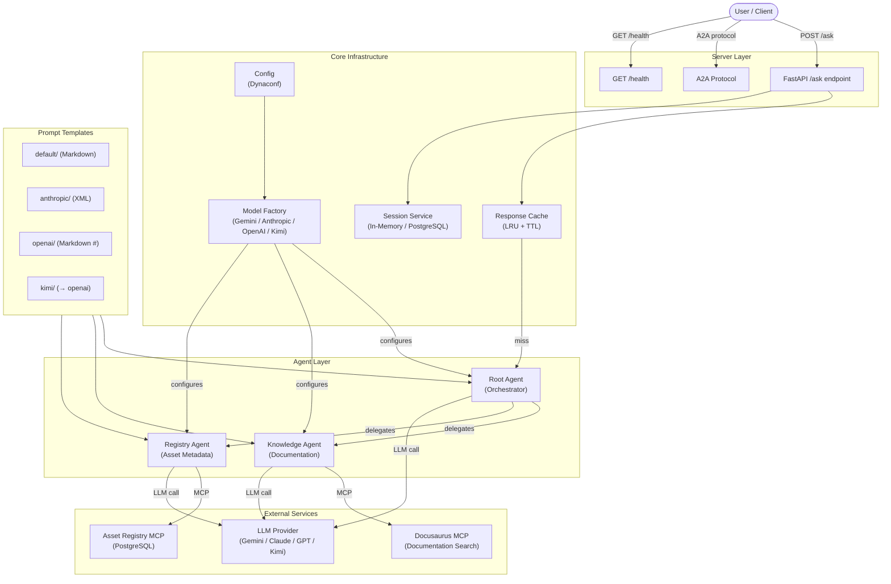
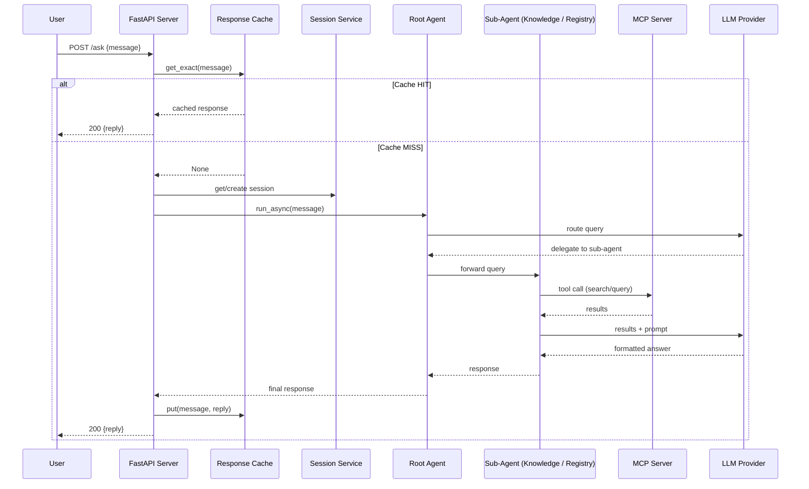

# Weave — Data Fabric AI Assistant

AI-powered chatbot for HSBC's Data Fabric platform. Supports multiple LLM providers with provider-optimized prompt formats.

## Architecture



## Quick Start

```bash
# Install dependencies
pip install -r requirements.txt

# Run locally (FastAPI mode, default: Gemini)
APP_ENV=local python main.py

# Run locally (A2A mode)
APP_ENV=local python main.py --a2a
```

## Multi-Model Support

Switch LLM providers via `conf/config.yaml`:

```yaml
llm:
  provider: gemini    # gemini | anthropic | openai | kimi
  model: gemini-2.5-flash
```

### Provider Setup

| Provider | Config `provider` | API Key Env Var | Example Model |
|----------|-------------------|-----------------|---------------|
| Google Gemini | `gemini` | (Vertex AI service account) | `gemini-2.5-flash` |
| Anthropic Claude | `anthropic` | `ANTHROPIC_API_KEY` | `claude-sonnet-4-20250514` |
| OpenAI GPT | `openai` | `OPENAI_API_KEY` | `gpt-4o` |
| Kimi (Moonshot) | `kimi` | `MOONSHOT_API_KEY` | `moonshot-v1-128k` |

### Prompt Formats

Each provider uses an optimized prompt format:

| Provider | Format | Location |
|----------|--------|----------|
| Gemini | Markdown | `prompts/default/` |
| Anthropic | XML tags | `prompts/anthropic/` |
| OpenAI | Markdown (# headers) | `prompts/openai/` |
| Kimi | Markdown (# headers) | `prompts/kimi/` (symlinks to openai/) |

## Request Flow



## Project Structure

```
├── prompts/             # System prompts (per-provider subdirectories)
│   ├── default/         #   Gemini / universal fallback (Markdown)
│   ├── anthropic/       #   Claude-optimized (XML)
│   ├── openai/          #   GPT-optimized (Markdown with # headers)
│   └── kimi/            #   Kimi (symlinks to openai/)
├── agents/              # Agent definitions (one per agent)
├── core/                # Shared infrastructure (config, model, MCP, sessions, cache)
├── server/              # Server setup (FastAPI + A2A)
├── utils/               # Utilities (prompt loader, logging)
├── conf/                # Configuration (Dynaconf YAML)
├── main.py              # Entry point
└── Dockerfile           # Container build
```

## Endpoints

- `GET /datafabric-weave-agent/health` — Health check (includes provider/model info)
- `POST /datafabric-weave-agent/ask` — Query the agent (FastAPI mode)
- `GET /.well-known/agent.json` — Agent Card (A2A mode)
