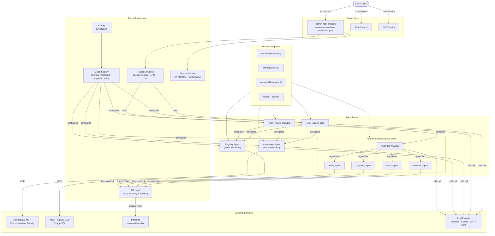
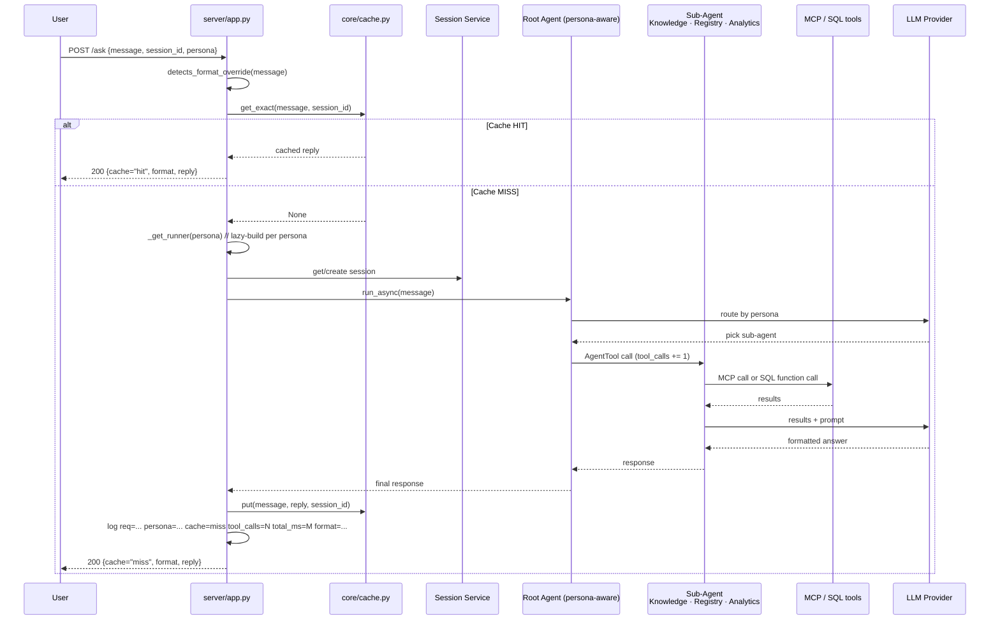

# Weave — Data Fabric AI Assistant

AI-powered chatbot for HSBC's Data Fabric platform. Supports multiple LLM
providers with provider-optimized prompt formats, and a **persona switch**
(FAB-2101) that adds a SQL-backed Analytics specialist alongside the existing
Knowledge + Registry agents.

## Architecture



### Persona Switch

- `weave-base` (default) — Knowledge + Registry only. Same behaviour as FAB-1417.
- `weave-analytics` — adds an Analytics wrapper that routes SQL EDA over a
  `transactions` Postgres table to four specialists: schema discovery,
  descriptive statistics, segmentation, fraud/anomaly detection.

Same `/ask` endpoint serves both (D8 — no new ports or processes). The
persona-analytics Runner is built **lazily** on first request, so
`weave-base`-only startups pay zero analytics cost.

## Quick Start

```bash
# Install dependencies
pip install -r requirements.txt

# Run locally (FastAPI mode, default: Gemini)
cd src
APP_ENV=local python main.py

# Run locally (A2A mode)
APP_ENV=local python main.py --a2a
```

### Using the analytics persona

```bash
# weave-base (default) — Knowledge + Registry
curl -X POST http://127.0.0.1:8080/datafabric-weave-agent/ask \
  -H 'Content-Type: application/json' \
  -d '{"message": "What datasets are available?"}'

# weave-analytics — adds SQL EDA over the transactions table
curl -X POST http://127.0.0.1:8080/datafabric-weave-agent/ask \
  -H 'Content-Type: application/json' \
  -d '{"message": "Show transaction count by region", "persona": "weave-analytics", "session_id": "s1"}'
```

Analytics requires the DB password at runtime (never committed — D14):

```bash
export APP_VECTOR_STORES__DB_IAM_PASS="<password>"
```

**Full end-to-end validation walkthrough**, including the 6-test smoke suite
and expected log output, lives in
[`docs/FAB-2101_VALIDATION.md`](docs/FAB-2101_VALIDATION.md).

## Multi-Model Support

Switch LLM providers via `conf/config.yaml`:

```yaml
llm:
  provider: gemini    # gemini | anthropic | openai | kimi
  model: gemini-2.5-flash
```

### Provider Setup

| Provider | Config `provider` | API Key Env Var | Example Model |
|----------|-------------------|-----------------|---------------|
| Google Gemini | `gemini` | (Vertex AI service account) | `gemini-2.5-flash` |
| Anthropic Claude | `anthropic` | `ANTHROPIC_API_KEY` | `claude-sonnet-4-20250514` |
| OpenAI GPT | `openai` | `OPENAI_API_KEY` | `gpt-4o` |
| Kimi (Moonshot) | `kimi` | `MOONSHOT_API_KEY` | `moonshot-v1-128k` |

### Prompt Formats

Each provider uses an optimized prompt format:

| Provider | Format | Location |
|----------|--------|----------|
| Gemini | Markdown | `prompts/default/` |
| Anthropic | XML tags | `prompts/anthropic/` |
| OpenAI | Markdown (# headers) | `prompts/openai/` |
| Kimi | Markdown (# headers) | `prompts/kimi/` (symlinks to openai/) |

## Request Flow

Cache key is `(session_id, sha256(normalised_message))` — same question in
different sessions never collides (D9). `detects_format_override` in the
user message marks the turn as `format=freeform` instead of the default
`structured` (D10). `tool_calls` and `total_ms` appear in a single log line
per request for latency tracking.



## Project Structure

```
src/
├── prompts/                     # System prompts (per-provider subdirectories)
│   ├── default/                 #   Gemini / universal fallback (Markdown)
│   ├── anthropic/               #   Claude-optimized (XML)
│   ├── openai/                  #   GPT-optimized (Markdown with # headers)
│   └── kimi/                    #   Kimi (symlinks to openai/)
├── agents/
│   ├── knowledge.py             # Knowledge sub-agent factory
│   ├── registry.py              # Registry sub-agent factory
│   ├── root.py                  # build_root_agent(persona) — persona-aware
│   ├── descriptions.py          # short agent descriptions
│   └── analytics/               # FAB-2101 — weave-analytics persona only
│       ├── factory.py           #   create_analytics_agent()
│       ├── schema.py            #   schema_agent
│       ├── stats.py             #   stats_agent
│       ├── segment.py           #   segment_agent
│       └── fraud.py             #   fraud_agent
├── core/
│   ├── config.py                # Dynaconf wrapper + configure_environment()
│   ├── model.py                 # get_model(), get_provider(), LiteLLM bridge
│   ├── mcp.py                   # MCP connection factory (streamable-http / SSE)
│   ├── cache.py                 # session-scoped ResponseCache (D9)
│   ├── session.py               # InMemory / DatabaseSessionService factory
│   ├── db.py                    # FAB-2101 — SQLAlchemy engine + SQL guards
│   ├── tools.py                 # FAB-2101 — 12 SQL tool functions
│   ├── schemas.py               # FAB-2101 — Pydantic output schemas per agent
│   └── format_override.py       # FAB-2101 — "as a table" detector
├── server/                      # FastAPI + A2A + agent card
├── utils/                       # logging + prompt loader
├── conf/config.yaml             # Dynaconf (local, dev profiles)
└── main.py                      # Entry point
```

## Endpoints

- `GET /datafabric-weave-agent/health` — status, active persona, cache stats
- `POST /datafabric-weave-agent/ask` — query the agent. Body:
  `{message, session_id?, user_id?, persona?}`. Response:
  `{session_id, user_id, reply, cache: hit|miss, format: structured|freeform}`.
- `GET /.well-known/agent.json` — A2A Agent Card (advertises both personas)
