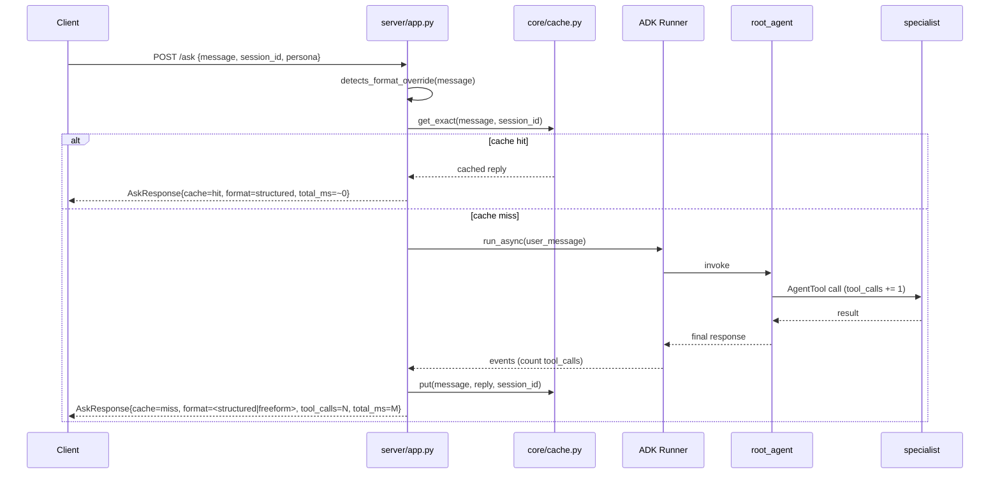

# FAB-2101 — Validation Guide

> Companion to the master plan at
> `../datafabric-analytics-agent/docs/FAB-2101_MASTER_PLAN.md` (scope lives
> in the analytics-agent repo because that's where Phase 1 happened). This
> file captures everything needed to validate the 10-stage implementation
> on the Windows HSBC server end-to-end. The macOS side is complete; this
> document is the hand-off.

## Status as of hand-off

All 10 stages landed. Static gates (ruff, ruff-format, mypy, 93 pytest cases)
are green on macOS. Runtime validation against Postgres + Vertex has not
happened and cannot happen outside HSBC infrastructure.

| Stage | What | Local gate | Remote gate |
|---|---|---|---|
| 0 | Deps baseline + pyproject | ✅ | — |
| 1 | Bug-fix sweep (6 + psycopg2 + CTE) | ✅ | — |
| 2 | Skeleton + config/model extraction | ✅ | — |
| 3 | MCP wiring, logging, prompt loader | ✅ | — |
| 4 | Collapse 3 processes → 1 | ✅ | ⚠️ needs Windows |
| 5 | Cherry-pick analytics into weave | ✅ | ⚠️ needs Windows |
| 6 | Persona switcher | ✅ | ⚠️ needs Windows |
| 7 | Per-provider prompts | ✅ | — |
| 8 | Latency instrumentation | ✅ | ⚠️ needs Windows (to capture numbers) |
| 9 | Session-scoped cache | ✅ | ⚠️ needs Windows (for persistence) |
| 10 | Output schemas + override detection | ✅ | ⚠️ needs Windows (for LLM compliance) |

---

## Target architecture

### Persona-switched weave-agent (post-Stage 6)

```mermaid
flowchart TD
    Caller[Caller<br/>UI · A2A · curl] -->|POST /ask<br/>{message, session_id, persona}| Server[server/app.py]

    Server --> Cache{Cache lookup<br/>session_id + hash}
    Cache -- hit --> Reply[AskResponse<br/>cache=hit · format=structured]
    Cache -- miss --> Runner[ADK Runner per persona]

    Runner --> RootBase["build_root_agent('weave-base')"]
    Runner --> RootAnalytics["build_root_agent('weave-analytics')"]

    RootBase --> KA[knowledge_agent]
    RootBase --> RA[registry_agent]
    RootAnalytics --> KA
    RootAnalytics --> RA
    RootAnalytics --> AA[analytics_agent wrapper]

    KA -->|MCP streamable-http| DocMCP[(Docusaurus MCP<br/>HSBC on-prem)]
    RA -->|MCP streamable-http| RegMCP[(Asset Registry MCP<br/>HSBC on-prem)]

    AA --> SA[schema_agent]
    AA --> STA[stats_agent]
    AA --> SE[segment_agent]
    AA --> FR[fraud_agent]

    SA -->|Python call| Tools[core/tools.py · 12 FunctionTools]
    STA -->|Python call| Tools
    SE -->|Python call| Tools
    FR -->|Python call| Tools

    Tools -->|SQLAlchemy + pg8000| DB[(Postgres<br/>transactions table)]
```

### Request lifecycle with latency/cache instrumentation (Stages 8-10)



---

## Known-manual items before you start

Three things the harness blocked me from writing. Do these once on Windows
before starting the agent.

### 1. Mirror `vector_stores:` into the `dev:` profile

Open `src/conf/config.yaml`. The `local:` profile has this block (I added it).
Copy it verbatim into the `dev:` profile alongside `vertexai:`:

```yaml
  # Analytics persona (FAB-2101). Secret via APP_VECTOR_STORES__DB_IAM_PASS.
  vector_stores:
    db_name: weave-dev
    db_iam_user: fabric-ai@hsbc-20016297-datafabric-dev.iam
    db_host: 10.98.45.217
    db_port: 5432
    db_iam_pass:
```

Also add `default_persona: weave-base` to the `dev:` profile's `app:` block.

### 2. Set the DB password env var

```powershell
$env:APP_VECTOR_STORES__DB_IAM_PASS = "<the actual password>"
```

Dynaconf picks this up via its nested-key `__` convention (D14). Never commit
the value to YAML.

### 3. SA key rotation (noted, not urgent)

`src/conf/hsbc-11597561-hydra-dev-*.json` is a GCP service-account private key.
Rotate it when convenient and `.gitignore` the file name pattern. Not a
FAB-2101 blocker.

---

## Pre-flight: regression pytest on the analytics repo

Run this first. Zero network, zero DB, zero Vertex — pure Python logic check.
If it fails, the issue is logic, not environment.

```powershell
cd C:\Users\45477698\Documents\GitHub\datafabric-analytics-agent
.venv\Scripts\Activate.ps1
pytest -q
```

Expected: `93 passed` in under 2 seconds. Covers:

- `core/db.py` guards: `_sanitise`, `check_select_only` (incl. CTE), `enforce_limit`, `_safe`.
- `core/cache.py`: TTL, LRU, stats, session-scoped keys.
- `utils/prompts.py`: provider fallback chain, path-traversal rejection, include sandbox.
- `core/tools.py`: input validation on all 12 tools.

If any test fails, **stop** and tell me — that's a logic regression and the
fix is on the macOS side, not yours to debug on Windows.

---

## Smoke test sequence (weave-agent)

Assumes you've applied Stages 5-10 changes to your Windows FAB-1417 branch
(files + paths in [Files changed](#files-changed-in-weave-agent) below).

### Start the server

```powershell
cd C:\Users\45477698\Documents\GitHub\datafabric-weave-agent\src
..\.venv\Scripts\Activate.ps1
$env:APP_VECTOR_STORES__DB_IAM_PASS = "<pw>"
python main.py
```

Expected log lines:

```
INFO  [core.config:80]     Environment configured (env=local, provider=gemini)
INFO  [__main__:24]        Starting Weave Agent (env=local, mode=fastapi, provider=gemini, model=gemini-2.5-flash)
INFO  [utils.prompts:88]   Loaded prompt 'knowledge_agent' for provider 'gemini' from default/knowledge_agent.md
INFO  [utils.prompts:88]   Loaded prompt 'registry_agent' for provider 'gemini' from default/registry_agent.md
INFO  [utils.prompts:88]   Loaded prompt 'root_agent' for provider 'gemini' from default/root_agent.md
INFO  [agents.root:21]     Building root agent (persona=weave-base)
INFO  [server.app:<line>]  (Runner built for weave-base)
INFO  [core.session:40]    Using InMemorySessionService (non-persistent, dev only)
INFO  [__main__:55]        Starting FastAPI server at 127.0.0.1:8080
INFO:  Uvicorn running on http://127.0.0.1:8080
```

Note: `analytics_agent` does NOT build at startup. That's correct — it lazy-
loads on first `weave-analytics` request.

### Health check

```powershell
Invoke-RestMethod -Uri "http://127.0.0.1:8080/datafabric-weave-agent/health"
```

Expected JSON (newly added fields — `default_persona`, `supported_personas`,
`ready_personas`):

```json
{
  "status": "ok",
  "llm_provider": "gemini",
  "llm_model": "gemini-2.5-flash",
  "default_persona": "weave-base",
  "supported_personas": ["weave-base", "weave-analytics"],
  "ready_personas": ["weave-base"],
  "cache_stats": {"size": 0, "max_size": 500, "hits": 0, "misses": 0, "hit_rate": "N/A"}
}
```

### Test 1 — `weave-base` regression (FAB-1417 behaviour)

```powershell
Invoke-RestMethod -Uri "http://127.0.0.1:8080/datafabric-weave-agent/ask" -Method Post `
  -Body '{"message":"What datasets are available?","session_id":"reg-1"}' `
  -ContentType "application/json"
```

Must still work exactly as FAB-1417 today. Server log line:

```
req=<id> persona=weave-base cache=miss tool_calls=<N> total_ms=<ms> reply_len=<len> format=structured session=reg-1
```

Response JSON:

```json
{
  "session_id": "reg-1",
  "user_id": "default_user",
  "reply": "...<knowledge/registry output>...",
  "cache": "miss",
  "format": "structured"
}
```

### Test 2 — analytics first call (lazy Runner build)

```powershell
Invoke-RestMethod -Uri "http://127.0.0.1:8080/datafabric-weave-agent/ask" -Method Post `
  -Body '{"message":"Show transaction count by region","persona":"weave-analytics","session_id":"ana-1"}' `
  -ContentType "application/json"
```

Expected in server log:

```
INFO  [server.app:<line>]  Lazy-building Runner for persona=weave-analytics
INFO  [agents.root:21]     Building root agent (persona=weave-analytics)
INFO  [agents.analytics.factory:<line>]  Initializing Analytics wrapper agent
INFO  [agents.analytics.schema:<line>]   Initializing Schema Agent
INFO  [agents.analytics.stats:<line>]    Initializing Stats Agent
INFO  [agents.analytics.segment:<line>]  Initializing Segment Agent
INFO  [agents.analytics.fraud:<line>]    Initializing Fraud Agent
...(Runner.run_async logs, tool calls)...
req=<id> persona=weave-analytics cache=miss tool_calls=<N> total_ms=<ms> reply_len=<len> format=structured session=ana-1
```

The response `reply` should include the analytics output (region breakdown
with counts). Structure should match the default output guidelines: summary →
details → (optional warnings) → next recommended analysis.

### Test 3 — cache hit (same question, same session)

Re-run Test 2 verbatim. Expected:

```json
{ "cache": "hit", "format": "structured", "reply": "<same as before>" }
```

Server log: `cache=hit tool_calls=0 total_ms=<~0>`.

### Test 4 — cache isolation (different session)

```powershell
# change session_id only
Invoke-RestMethod -Uri "http://127.0.0.1:8080/datafabric-weave-agent/ask" -Method Post `
  -Body '{"message":"Show transaction count by region","persona":"weave-analytics","session_id":"ana-2"}' `
  -ContentType "application/json"
```

Expected: `"cache":"miss"` — different session must not see ana-1's cached reply (D9).

### Test 5 — format override

```powershell
Invoke-RestMethod -Uri "http://127.0.0.1:8080/datafabric-weave-agent/ask" -Method Post `
  -Body '{"message":"Show fraud trends as a table","persona":"weave-analytics"}' `
  -ContentType "application/json"
```

Expected: `"format":"freeform"` and the reply genuinely in table form (the LLM
was told to honour the override this turn).

### Test 6 — health after traffic

```powershell
Invoke-RestMethod -Uri "http://127.0.0.1:8080/datafabric-weave-agent/health"
```

`ready_personas` should now include both personas. `cache_stats.size > 0`.

### Process count

```powershell
Get-Process python | Measure-Object
```

Expected: 1 python process (or 1 + uvicorn worker child). No second FastAPI
or FastMCP daemon anywhere.

---

## What "done" looks like (master-plan acceptance criteria)

Mapped from the master plan in `datafabric-analytics-agent/docs/FAB-2101_MASTER_PLAN.md`:

- [ ] `weave-analytics` persona reachable via `/ask` — Test 2.
- [ ] `weave-base` regression clean — Test 1.
- [ ] Same question in same session returns `cache=hit` — Test 3.
- [ ] Same question in different session returns `cache=miss` — Test 4.
- [ ] Same question yields same structural shape across runs — eye-ball Test 2's reply vs a repeat in a fresh session.
- [ ] Format override respected per-turn — Test 5.
- [ ] Single-process startup — process count check.
- [ ] All 8 known bugs from `ANALYTICS_AGENT.md` closed — addressed in Stage 1.
- [ ] No regression on Knowledge + Registry — Test 1.
- [ ] README documents the persona switch — still TODO, see [Follow-ups](#follow-ups).

---

## Files changed in weave-agent

Paths shown relative to the FAB-1417 `src/` root.

### New

```
agents/analytics/__init__.py
agents/analytics/factory.py
agents/analytics/schema.py
agents/analytics/stats.py
agents/analytics/segment.py
agents/analytics/fraud.py
core/db.py
core/tools.py
core/schemas.py
core/format_override.py
prompts/default/analytics_agent.md
prompts/default/schema_agent.md
prompts/default/stats_agent.md
prompts/default/segment_agent.md
prompts/default/fraud_agent.md
prompts/anthropic/analytics_agent.xml
prompts/anthropic/schema_agent.xml
prompts/anthropic/stats_agent.xml
prompts/anthropic/segment_agent.xml
prompts/anthropic/fraud_agent.xml
```

### Modified

```
agents/__init__.py                         # exports build_root_agent (factory)
agents/root.py                             # persona-aware factory
agents/descriptions.py                     # +5 analytics descriptions
core/cache.py                              # session-scoped keys (D9)
server/app.py                              # persona field, latency log, cache+format in AskResponse
server/agent_card.py                       # fabric-analytics A2A skill
conf/config.yaml                           # +default_persona, +vector_stores: (local only)
requirements.txt                           # +sqlalchemy, +pg8000
prompts/default/root_agent.md              # +analytics routing, +output structure
prompts/anthropic/root_agent.xml           # same
prompts/openai/root_agent.md               # same
prompts/kimi/root_agent.md                 # same
```

### Manual (harness blocked)

```
conf/config.yaml dev: profile              # mirror vector_stores: block
```

---

## Rollback plan

If `weave-analytics` causes a regression in `weave-base`:

1. **Config-only rollback**: set `default_persona: weave-base` in `conf/config.yaml`
   and tell callers not to pass `persona="weave-analytics"`. Analytics code
   stays in the tree but is unreachable. Zero redeploy.
2. **Full rollback**: revert the Stage 5/6 commits in git. The new files and
   edits are all additive; revert is clean.

Per D11 (no background workers), there's nothing stateful to unwind.

---

## Observability quickref

Every `/ask` emits one structured log line:

```
req=a1b2c3d4 persona=weave-analytics cache=miss tool_calls=3 total_ms=2145 reply_len=412 format=structured session=ana-1
```

Fields:

| Field | Meaning |
|---|---|
| `req=<id>` | 8-char uuid fragment; correlates errors with reply |
| `persona` | `weave-base` or `weave-analytics` |
| `cache` | `hit` or `miss` |
| `tool_calls` | Number of sub-agent / tool invocations observed in the Runner event stream |
| `total_ms` | Wall-clock ms from request entry to response send |
| `reply_len` | Characters in the final reply text |
| `format` | `structured` (default) or `freeform` (override detected in user message) |
| `session` | Session id used for cache namespacing |

Baseline numbers you should capture after first successful run:

- Median `total_ms` for a simple `weave-base` query.
- Median `total_ms` for a simple `weave-analytics` query (Test 2).
- Cache-hit `total_ms` (Test 3) — should be <20 ms.

Drop those into the master plan's Sprint 3.1 deliverable section
as the before/after baseline.

---

## Follow-ups (not blockers)

- [ ] Update `README.md` in weave-agent to document the persona switch.
- [ ] Rotate the GCP service-account key and `.gitignore` the JSON file.
- [ ] Decide whether the analytics persona should be rate-limited separately
      from base (only matters if traffic patterns diverge).
- [ ] After Windows validation, tag `datafabric-analytics-agent` as
      `pre-merge-snapshot-FAB-2101` and archive the repo (master plan
      "Final Merge Strategy" step).
- [ ] Optional: migrate `prompts/openai/` and `prompts/kimi/` analytics-agent
      variants if GPT/Kimi outputs prove inconsistent vs Anthropic/Gemini.
      Today they fall through to `prompts/default/`.

---

## If something breaks on Windows

Pattern:

1. Check server log for the one-line `req=...` entry — it tells you persona,
   cache status, tool_calls, total_ms, format.
2. Re-run `pytest -q` on analytics-agent. If green, logic is fine.
3. Narrow by persona:
   - Does `weave-base` still work? If no → persona factory issue, revert to
     `agents/root.py` behaviour from FAB-1417 git log.
   - Does `weave-analytics` fail at Runner-build time? Likely env var
     (`APP_VECTOR_STORES__DB_IAM_PASS`) missing.
   - Does `weave-analytics` fail during tool execution? SQLAlchemy/Postgres
     connection — check `core/db.py:_db_url()` against the actual DSN.
4. Capture the `req=<id>` from the log and send me that + the stack trace.

---

*Generated 2026-04-23 during Stage 0-10 implementation session.*
